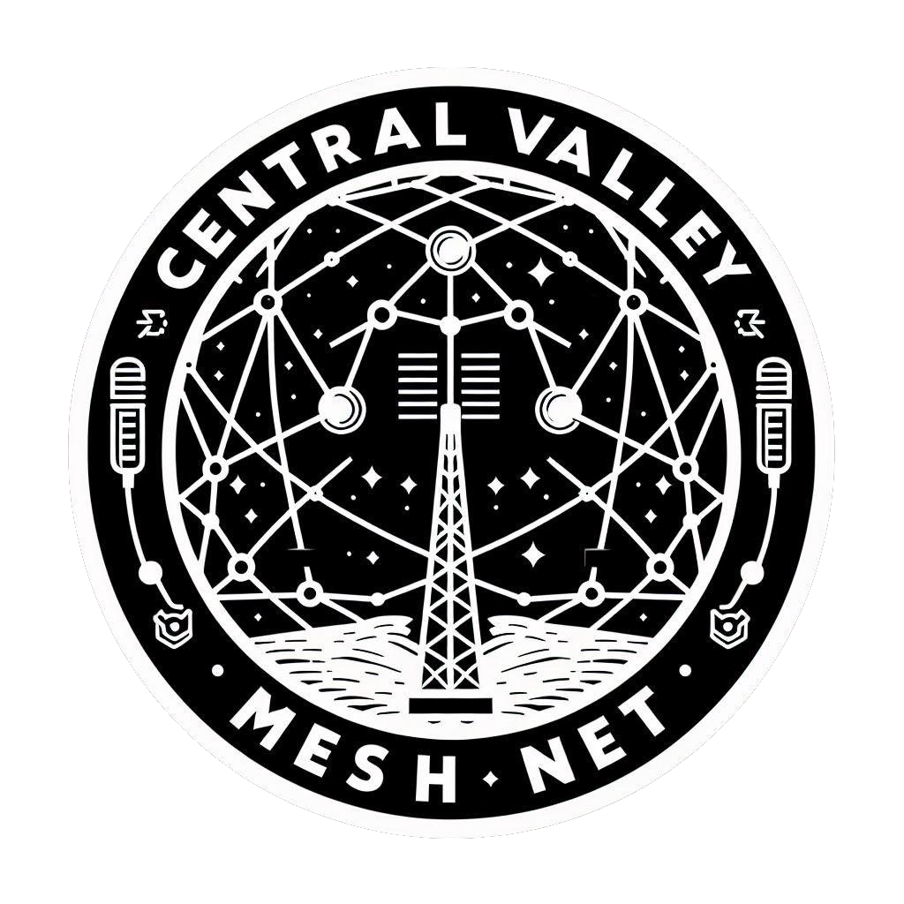



  <h1 class="home_header">Welcome to Central Valley Mesh: A Meshtastic Community Site!</h1>

 
 
<a class="btn btn-lg btn-primary me-3 mb-4" href="/about/">
  Learn More <i class="fas fa-arrow-alt-circle-right ms-2"></i>
</a>
<a class="btn btn-lg btn-primary me-3 mb-4" href="/docs/">
  Read Our Docs &nbsp;<i class="fa-solid fa-book"></i>
</a>
<a class="btn btn-lg btn-primary me-3 mb-4" href="/blog/">
  Check Out Our Builds &nbsp;<i class="fa-solid fa-screwdriver-wrench"></i>
</a>
<a class="btn btn-lg btn-primary me-3 mb-4" href="https://discord.com/invite/9KUu5QQqMx">
  Discord <i class="fab fa-github ms-2 "></i>
</a>
<!-- 
Porridge temperature assessment &mdash; in the cloud!
 -->



{}
Welcome to the [Meshtastic](https://meshtastic.org/) Community Page for the [Central Valley of California, USA](https://en.wikipedia.org/wiki/Central_Valley_(California))!

Please note that our website is a work in progress, so the layout and/or content may change, so please check back often. We're working hard to bring you a fantastic online experience! While our website is still being built, we invite you to join our community on Discord for the latest updates & discussions: [Join Our Discord Community](https://discord.gg/9KUu5QQqMx). We can't wait to see you there!

Please check back soon for more updates.
{}

<!-- 
{}
{}
The Goldydocs UI now shows chair size metrics by default.

Please follow this space for updates!
{}

{}
We do a [Pull Request](https://github.com/google/docsy-example/pulls) contributions workflow on **GitHub**. New users are always welcome!
{}

{}
For announcement of latest features etc.
{}

{}

{}
This is the second section
{.h1 .text-center}
{}

{}

{}
Get the Goldydocs app!
{}

{}
We do a [Pull Request](https://github.com/google/docsy-example/pulls)
contributions workflow on **GitHub**. New users are always welcome!
{}

{}
For announcement of latest features etc.
{}

{}

{}
This is the another section
{.h1 .text-center}
{} -->